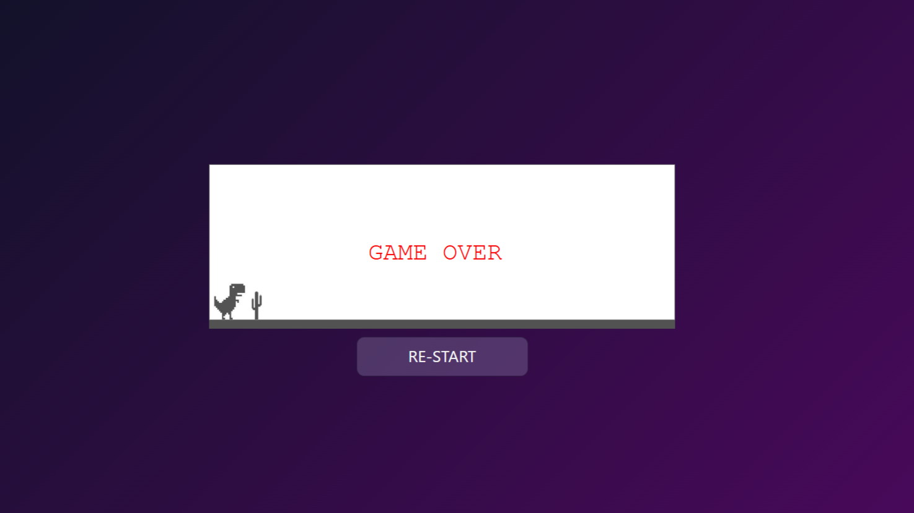

# T-Rex Game

A simple browser-based T-Rex game where you control the dinosaur to jump over obstacles.

## Description

This game is inspired by the offline Dino game in Google Chrome. The objective is to jump over the cactus obstacles to avoid collision. The game ends when you hit an obstacle, and you can restart it by clicking the "RE-START" button.

## Features

- **Jump Mechanism**: Press `Space` or `Arrow Up` to make the T-Rex jump.
- **Collision Detection**: Game ends if the dinosaur collides with the obstacle.
- **Game Over Screen**: Displays when the game is over with the option to restart.
- **Responsive Layout**: The game adjusts to the screen size for a seamless experience.

## Installation

1. Clone this repository to your local machine:
   ```bash
   git clone https://github.com/yourusername/t-rex-game.git
   ```
2. Navigate to the project directory:
   ```bash
   cd t-rex-game
   ```
3. Open index.html in your browser to view and interact with the game:

    