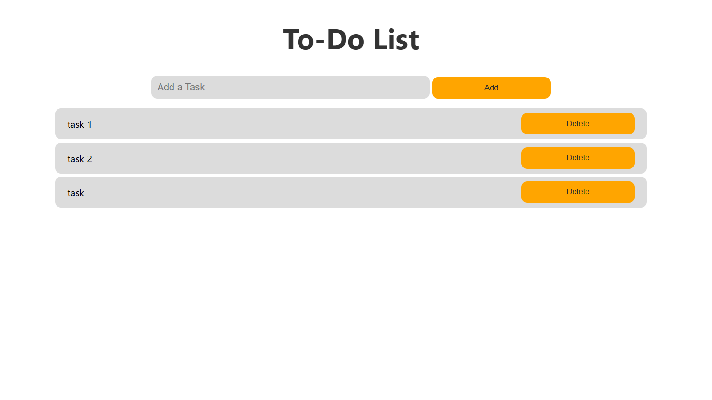

# Simple To-Do List Application

A simple to-do list application built using HTML, CSS, and JavaScript. This app allows users to add tasks, delete them, and persist the task list using the browser's localStorage, without requiring a backend database.

## Features
- Add tasks to the to-do list.
- Mark tasks for deletion.
- Store tasks locally in the browser using `localStorage`.

    