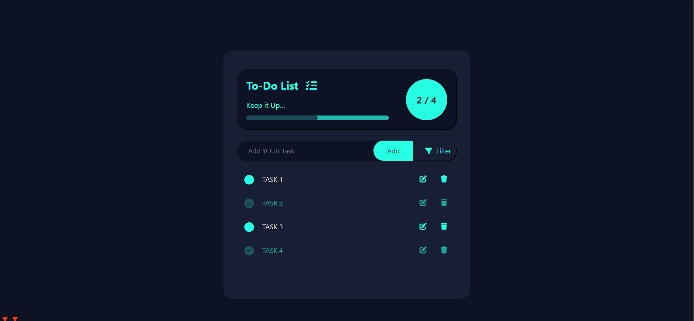

# To-Do List App

## Description

This is a simple and interactive To-Do List app built using HTML, CSS, and JavaScript. It allows users to add, edit, delete, and filter tasks based on their completion status. It also features a progress bar that tracks the number of tasks completed, providing a visual representation of task progress. The data is saved locally using `localStorage`, so your tasks persist even after the page reloads.

## Features

- **Task Management**: Add, delete, and edit tasks dynamically.
- **Task Filtering**: Filter tasks by their completion status (All, Complete, Incomplete).
- **Progress Bar**: Visual progress bar that updates based on the completion of tasks.
- **Local Storage**: Saves your tasks locally so that they persist even after the page is reloaded.
- **Warning for Empty Tasks**: If you try to add an empty task, a warning icon will appear.
- **Task Status Toggle**: Mark tasks as complete or incomplete by clicking on them.
- **Responsive Design**: The app is fully responsive and works seamlessly on both desktop and mobile devices.

## Installation

1. Clone this repository to your local machine:
   ```bash
   git clone https://github.com/yourusername/todo-list-app.git
   ```
2. Navigate to the project directory:
    ```
    cd todo-list-app
    ```
3. Open index.html in your browser to view and interact with the To-Do List app.

