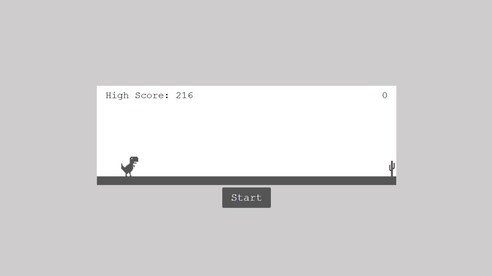

# Dino Game

A simple browser-based Dino game inspired by the Google Chrome offline game. It tracks and saves your high score using localStorage.

## Description

This is a simple implementation of the iconic Dino game, where you control a dinosaur to jump over cacti. The goal is to survive as long as possible without colliding with the obstacles. The game gets more challenging as your score increases.

## Features

- **Jump Mechanism**: Press `Space` or `Arrow Up` to make the Dino jump.
- **Dynamic Speed**: As your score increases, the speed of the obstacles adjusts.
- **Collision Detection**: The game ends when the Dino collides with an obstacle.
- **High Score**: Tracks and stores your high score using localStorage.
- **Game Over Screen**: Displays when you lose and allows you to restart the game.

## Installation

1. Clone this repository to your local machine:
   ```bash
   git clone https://github.com/yourusername/dino-game.git
   ```
2. Navigate to the project directory:
   ```bash
   cd dino-game
   ```
3. Open index.html in your browser to view and interact with the game:

    